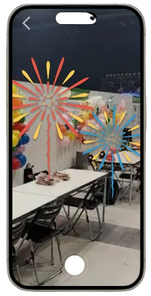
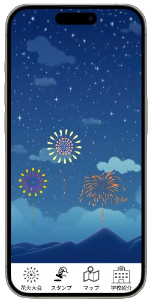

<!-- _class: title -->
# 多人数参加型アプリ企画書
## 河原学園大学園祭2024展示用
### 学園祭運営委員会 御中
#### ITイノベーション科2年 村上班

---
# 目次
- このアプリを企画した理由
- ITイノベーション科が抱える課題
- 課題の解決策
- アプリ概要
- アプリの機能と課題の解決策
- アプリに関連するイベントの提案
- 学園祭実行委員会へのお願い

---
# このアプリを企画した理由
1. 私はITイノベーション科の一員として、みんなを楽しませるような新しいイノベーションを生み出そうと思っている
2. そのための手段は、「デジタルアートを作るアプリ」
3. そのアプリとして、多人数参加型アート作成アプリ"HANABINOVATION"を提案

---
# ITイノベーション科が抱える課題
作品を作って展示するからには、多くの顧客に作品に触れて欲しい。
しかし、弊学科は「集客」という点において、いくつかの不利な点を負っている。
1. 他学科の得意な分野の作品を作ってしまうと、集客の面で劣ってしまうこと
    - ITイノベーション科の得意なWebアプリで作成したゲームでは、本職のゲームクリエイター科のゲームと競合してしまう
2. 所謂"真面目"なアプリは、集客の面で劣ってしまうこと
    - カレンダーアプリや図書館アプリは、受けが悪い
3. 人員不足により、顧客の呼び込みが現実的でないこと
    - 10人しかいないのに複数班に分かれるため、1班当たりの人数が少ない
4. ブースは1班1PCであり、グループで行動している顧客に対応しづらいこと
    - PCだけだと、グループの中の1人にしか作品を体験してもらえない

---
# 課題の解決策
競合他学科より現状不利な「集客」という点について、以下の解決策を考えた。
1. オリジナリティを出す
    - Webアプリで「ゲーム」を制作してしまうと、ゲームクリエイター科と比較して見劣りしてしまう
    - そのため、ITイノベーション科にしか作れないようなアプリの制作を狙う
2. "面白い"アプリを制作する
    - アプリに"面白さ"を盛り込むことで、見た目上の魅力を最大限アピールし、集客に繋げる
    - 「図書館アプリ」「カレンダーアプリ」が集客に繋がらなかったのは、見た目に動きがなく、"地味"であったことが原因と推測
    - ただし、オリジナリティの面から「ゲーム」以外の"面白さ"である必要

---
# 課題の解決策
3. どこからでもアプリを体験できるようにする
    - 呼び込みを行う必要があるのは、顧客を自分のブースへと誘導する必要があるため
        - そのため、会場内の様々な場所からアプリにアクセスできるようにしたい
        - そうすることで、「多くの人にアプリに触れて欲しいが、呼び込みは現実的でない」という課題がある程度解決する可能性がある
4. スマホからアプリを体験できるようにする
    - PCが1台しかないと、グループで行動している顧客は1人を除いて暇になってしまうことを恐れ、ブースへの訪問をスルーしてしまう可能性がある
        - そのため、スマホからアプリを体験できるようにし、グループ全員で楽しめるような仕組みを作る

---
# アプリ概要
- 弊学科の強みであるWebアプリを制作することが、「オリジナリティを出す」という解決策に結び付くと考えた。
    - そのため、Webアプリの強みである「インストール不要で、スマホで体験できる」という点を前面に押し出したアプリを制作したい。
- 「ゲーム」、つまり「遊び」以外の"面白さ"という点について、「アート」という点に着目した。
    - そのため、何か芸術作品を生み出すようなWebアプリを制作したい。
    - ただし、音楽的なアートは会場が騒がしいため音が掻き消されてしまうという点から好ましくなく、
    文学的なアートは分かりやすさの面で"面白さ"を出すのが難しいと考えられる。

---
# アプリ概要
そこで、以下のようなWebアプリを考えた。
## 多人数参加型アート作成アプリ「HANABINOVATION」
- ユーザーはQRコードが設置された各学園のブースを回ることで、それぞれのブースで自分のデザインした「花火」を打ち上げることができる
    - スマホで写真を撮ることで、画面上に「花火」を打ち上げることができる
        - 現実空間上に、仮想の花火が打ち上がるイメージ
        - 写真は、ユーザーにとって学園祭の思い出になることを想定
- 花火の写真を撮った後は、夜空をバックに自分の花火を含めた直近のユーザーの花火が打ち上がる、「花火大会」が楽しめる

---
# アプリの機能と課題の解決策
## 「花火スタンプラリー」
- ユーザーはQRコードが設置された各学園のブース（飲食店は要検討）を回って、各ブースでスマホ画面上に仮想の花火を打ち上げて写真を撮れる
    - つまり、「各ブースでQRコードを読み取り、写真を撮る」行為が、「スタンプラリーへの参加」となる
    - 入場時のパンフレットに導入用QRコードとアプリの紹介を載せてもらう想定

---
# アプリの機能と課題の解決策
## 「花火スタンプラリー」
- 後述する「花火大会」機能を楽しむために、ユーザーは独創性溢れる花火を作成できる
    - 花火のデザインは各ブースごとに異なるセットアップから選択し、それぞれのブースごとに違った色・形・アイコンの花火を楽しめる
        - 電子ビジネス専門学校のブースならパソコンの形の花火が、調理専門学校のブースならフライパンの形の花火が上げられるイメージ
        - ユーザーが希望する場合は、ユーザーが自分で花火をデザインすることもできる

---
# アプリの機能と課題の解決策
## 「花火スタンプラリー」が解決する課題
- 「動き」があり、見た目上の"面白さ"を確保できる
    - 「花火を打ち上げる」という動作は分かりやすく、"面白さ"を確保できる
    - 課題２「"真面目"なアプリは集客の面で劣ってしまう」という問題を解決
- 「スタンプラリー」という形式を取っており、自ブースへの呼び込みの優先度が低くなる
    - 会場内の様々な場所からアプリにアクセスできるため、呼び込みで顧客を自ブースへ連れてくる必要がなくなる
    - 課題３「人員不足により、顧客の呼び込みが現実的でない」という問題を解決

---
# アプリの機能と課題の解決策
## 「花火大会」
- 花火の写真を撮った後は、夜空の画像をバックに自分の花火を含めた直近のユーザーの花火が打ちあがる、「花火大会」が楽しめる
- 各ユーザーがデザインした、独創性溢れる花火をその場で鑑賞できる
    - 「花火スタンプラリー」機能を通して、みんなで「花火大会」というアートを創り上げていくイメージ
    - 本アプリを「多人数参加型」と称した所以

---
# アプリの機能と課題の解決策
## 「花火大会」が解決する課題
- 「花火大会」機能は、「ユーザーが一丸となってひとつのアートを作る」ということであり、他学科には真似しづらい
    - 課題１「他学科の得意な分野の作品を作ってしまうと、集客の面で劣ってしまう」という問題を解決
    - なぜ他学科には真似しづらいのか？
        - 弊学科の強みであるWebアプリの特長、「インストール不要で、スマホで体験できる」という点を活かし、
        ブースを超えて対応可能なユーザー数を増やすことでこのコンセプトを実現している

---
# アプリの機能と課題の解決策
## 「花火大会」が解決する課題
- 他ユーザーがデザインした花火を閲覧できるため、グループで行動しているような顧客に対してのアプローチとなる
    - 課題４「ブースは1班1PCであり、グループで行動している顧客に対応しづらい」という問題を解決
    - 「みんなで楽しめる」ものであるため、他班にありがちな「PCが1台しかないから、自分がこのブースを体験してしまうと他のメンバーが暇してしまうのではないか」といった、ブースへの訪問を妨げるような顧客心理の影響が低い

---
# アプリの機能
アプリのUX（ユーザー体験）をより良くするために、他にも機能を提案
## 「QR読み取り機能」
- 別のブースを訪れる度にいちいち別のQR読み取り用アプリを開くのは面倒であるため、本アプリの機能として「QR読み取り機能」を実装

## 「マップ表示機能」
- スタンプラリーを円滑に進めるため、スタンプラリー用QRコードが展示してある場所をマップで表示する機能
- ただし、できるだけアプリの機能は少なく、単純である方が好ましい
    - 運用でカバーできる場合、この機能は必要ないため検討が必要
---
# アプリに関連するイベントの提案
「花火スタンプラリー」機能のインセンティブとして、以下のようなイベントを提案
## 「プロジェクターで花火大会」
1. 各ブースで花火をデザインし写真を撮った後、弊学科のブースに来てもらう
2. 弊学科のブースのQRコードを読み込むと、プロジェクターで投影された画面に、読み込んだユーザーがデザインした花火が音付きで一気に打ち上がる

- 自分がデザインして創ったものを公開できるという"面白さ"
- ITイノベーション科のブースに来てもらうための動機付けにもなる
    - ITイノベーション科のブース以外でもアプリを体験できるとはいえ、どうせなら実際のブースにも来てもらいたい

---
# アプリに関連するイベントの提案
## 「抽選会ステージイベント」
- 花火スタンプラリーをすべて巡り終えた人に、抽選で図書カード等の景品をプレゼントするステージイベント
- 当選者発表の際には、ステージ上に用意された画面に、当選者のデザインした花火が一気に打ち上がる
- KBCのステージの出し物の1つとしても、抽選会は活用できる
- ただし、個人情報の取り扱いや、当選者不在時の対応は留意する必要
    - 抽選を希望するユーザーには、不在時対応のためのメールアドレス等の提供協力をお願いする必要がある
    - 個人情報提供を望まない一部のユーザーにはインセンティブにならない

---
# 学園祭実行委員会へのお願い
本プロジェクトが魅力的であれば、
学園祭参加者に対するITイノベーション科、ひいてはKBCのアピールのために、
どうか以下についてご協力を検討いただけないでしょうか。
1. イベント告知のパンフレット記載
2. 実行委員会から他学校への、各ブースへのQRコードの展示の要請
3. スタンプラリーの景品抽選会イベントの実施（実施を行う場合）
    - スタンプラリー制覇者に抽選配布用の、景品（要検討）の購入
    - 当選者発表当日、不在の当選者への対応のお願い