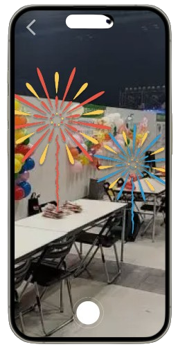

<!-- _class: title -->
# 多人数参加型アプリ企画書
## 河原学園大学園祭2024展示用
学園祭運営委員会 御中
ITイノベーション科3年 村上班

---
# 目次
- 誰に向けたアプリなのか
- 現状の課題
- 課題の解決策
- アプリ概要
- アプリの機能と課題の解決策
- アプリの機能と課題の解決策のまとめ
- 学園祭実行委員会へのお願い

---
# 誰に向けたアプリなのか
本プロジェクトは河原学園大学園祭2024において、河原学園電子ビジネス専門学校ITイノベーション科3年より公開予定のアプリの作成を目的としたものであり、
そのターゲットユーザーは、学園祭の主な参加者である高校生を想定している。

- ターゲットユーザーを絞るのであれば、入学希望者の増加を期待し、ターゲットユーザーを高校生に設定するのが望ましい
- 例年の参加者割合の傾向として、学園祭1日目は高校生が、2日目は子連れの家族が多い
    - 高校生をターゲットユーザーとするなら、1日目を重視した方がいい

---
# 現状の課題
作品を作って展示するからには、多くの顧客に作品に触れて欲しい。
しかし、弊学科は「集客」という点において、いくつかの不利な点を負っている。
- ITイノベーション科は、主にWebアプリを制作するのに向いた技術の学習を行っている学科であること
    - Webアプリで「ゲーム」を制作した班もいるが、隣のブースで展示を行っているゲームクリエイター科ではUnity等ゲームエンジンを用いたゲーム制作を行っており、どうしても集客の面で劣ってしまっている
- 他学科含めた様子から、「図書館アプリ」「カレンダーアプリ」のような所謂"真面目"なアプリは、ネイティブアプリ、Webアプリ問わず集客の面で劣ってしまう

---
# 現状の課題
- 人員不足により、顧客の呼び込みが現実的でないこと
    - ITイノベーション科3年は、学生が10人程度の学科であり、さらにその中からいくつかの班に分かれて作品制作を行っている
        - 一人はブースに残らねばならず、さらにそこから人員を割いて呼び込みを行うとなるとどうしてもハードスケジュールとなってしまう
    - 例年、自衛隊や他学園の呼び込みに比べて、河原学園電子ビジネス専門学校の呼び込みは圧倒的に少ない
- ブースは1班1PCであり、グループで行動している顧客に対応しづらいこと
    - 例年、高校生はグループでブースを見て回っていることが多い
    しかし、1班につきPCが1台しかないと、グループの中の1人にしか作品を体験してもらえない

---
# 課題の解決策
ITイノベーション科は集客の面において、競合他学科より現状不利である。そのため、以下の解決策を考えた。
- オリジナリティを出す
    - 「ゲーム」を制作するのではゲームクリエイター科と比較して見劣りしてしまうため、ITイノベーション科にしか作れないようなアプリの制作を狙う
- "面白い"アプリを制作する
    - アプリに"面白さ"を盛り込むことで、見た目上の魅力を最大限アピールし、集客に繋げる
    - 「図書館アプリ」「カレンダーアプリ」が集客に繋がらなかったのは、見た目が"地味"であったことが原因と推測
    - ただし、オリジナリティの面から「ゲーム」以外の"面白さ"である必要

---
# 課題の解決策
- どこからでもアプリを体験できるようにする
    - 呼び込みを行う必要があるのは、顧客を自分のブースへと誘導する必要があるため
        - そのため、会場内の様々な場所からアプリにアクセスできるようにすれば、「多くの人にアプリに触れて欲しいが、呼び込みは現実的でない」という課題がある程度解決する可能性がある
- スマホからアプリを体験できるようにする
    - PCが1台しかないと、グループで行動している顧客は1人を除いて暇になってしまうことを恐れ、ブースへの来訪をスルーしてしまう可能性がある
    そのため、スマホからアプリを体験できるようにし、グループ全員で楽しめるような仕組みを作る
---
# アプリ概要
- 弊学科の強みであるWebアプリを制作することが、「オリジナリティを出す」という解決策に結び付くと考えた。
    - そのため、Webアプリの強みである「インストール不要で、スマホで体験できる」という点を前面に押し出したアプリを制作したい。
- 「ゲーム」、つまり「遊び」以外の"面白さ"という点について、「アート」という点に着目した。
    - そのため、何か芸術作品を生み出すようなWebアプリを制作したい。
    - ただし、音楽的なアートは会場が騒がしいため音が掻き消されてしまうという点から好ましくなく、
    文学的なアートは分かりやすさの面で"面白さ"を出すのが難しいと考えられる。

---
# アプリ概要
そこで、以下のようなWebアプリを考えた。
## 多人数参加型アプリ「HaNavi」
- ユーザーはQRコードが設置された各学園のブースを回ることで、それぞれのブースで自分のデザインした「花火」を打ち上げることができる
    - スマホで写真を撮ることで、画面上に「花火」を打ち上げることができる
        - 現実空間上に、仮想の花火が打ち上がるイメージ
        - 写真は、ユーザーにとって学園祭の思い出になることを想定
- 花火の写真を撮った後は、夜空をバックに自分の花火を含めた直近のユーザーの花火が打ち上がる、「花火大会」が楽しめる

---
# アプリの機能と課題の解決策
## 「花火スタンプラリー」
- ユーザーはQRコードが設置された各学園のブース（飲食店は要検討）を回って、各ブースでスマホ画面上に仮想の花火を打ち上げて写真を撮れる
    - つまり、「各ブースでQRコードを読み取り、写真を撮る」行為が、「スタンプラリーへの参加」となる
    - 入場時のパンフレットに導入用QRコードとアプリの紹介を載せてもらう想定

---
# アプリの機能と課題の解決策
## 「花火スタンプラリー」
- 花火のデザインは各ブースごとに異なるセットアップから選択し、それぞれのブースごとに違った色・形の花火を楽しめる
    - 電子ビジネスならパソコンの形の花火が、調理ならフライパンの形の花火が上げられるイメージ
- 各ブースで花火の写真を撮るごとに、スタンプカードのようなものにそれぞれのブースでデザインした花火が記録され、一覧で表示できる

---
# アプリの機能と課題の解決策
## 「花火スタンプラリー」の注意点
- ただし、参加者に対するスタンプラリーへの動機付けが必要
    - 学校ブースのPR効果はほぼスタンプラリー機能が担っているため、費用の捻出（スタンプラリーの報酬を用意する等）を検討したい
    - ターゲットユーザーを学生に絞り、スタンプラリー制覇者に図書カード等の景品を抽選で配る等の報酬が考えられる
        - KBCのステージの出し物の1つとしても抽選会は活用できる
        - 高校生は1日目に多いため、実行するのであれば1日目と2日目に分割して行った方が良い
        - ユーザーからアンケートで連絡先を提供していただける場合、景品受け取り時に不在の場合は後日運営側から連絡を取ることも可能

---
# アプリの機能と課題の解決策
## 「花火スタンプラリー」が解決する課題
- 「動き」があり、見た目上の"面白さ"を確保できる
    - カレンダーアプリや図書館アプリに不足しがちな、見た目上の"面白さ"に繋がる「動き」という点において、「花火を打ち上げる」という動作は分かりやすく、"面白さ"を確保できる
- 「スタンプラリー」という形式を取っており、会場内の様々な場所からアプリにアクセスできるため、自ブースへの呼び込みの優先度が低くなる
    - 様々な場所で本アプリのことが目につけば、呼び込みと並ぶ広告効果を得られる
    - 呼び込みを行う場合も、顧客を自ブースへ連れてくる必要がなくなる

---
# アプリの機能と課題の解決策
## 「花火大会」
- 花火の写真を撮った後は、夜空の画像をバックに自分の花火を含めた直近のユーザーの花火が打ちあがる、「花火大会」が楽しめる
- 各ユーザーがデザインした、オリジナリティ溢れる花火をその場で鑑賞できる
    - 「花火スタンプラリー」機能を通して、みんなで「花火大会」というアートを創り上げていくイメージ
    - 本アプリを「多人数参加型」と称した所以

---
# アプリの機能と課題の解決策
## 「花火大会」が解決する課題
- 「花火大会」機能で様々なユーザーがデザインした花火を閲覧できるという機能はつまり、「ユーザーが一丸となってひとつのアートを作る」ということであり、他学科には真似しづらい
    - 「モバイル対応」「Webアプリ」の2点により、1ブースで対応可能なユーザー数を増やすことでこのコンセプトを実現している
- 他ユーザーがデザインした花火を閲覧できるため、グループで行動しているような顧客に対してのアプローチとなる
    - 「みんなで楽しめる」ものであるため、他班にありがちな「PCが1台しかないから、自分がこのブースを体験してしまうと他のメンバーが暇してしまう」といったような顧客心理の影響が低い

---
# アプリの機能と課題の解決策
## 「マップ表示」
- 現在地と、次にQRコードを読み込みに行けるブースを地図上に示してくれる
- 現在地から一番近いブースを強調表示することにより、ナビゲーション機能を持つ
    - "HaNavi"は、"Hanabi"(花火)と"Navigation"が由来のアプリ名
- マップから各ブースをタップすると、例年の学園祭のブース内容が見られる

---
# アプリの機能と課題の解決策
## 「マップ表示」が解決する課題
- スタンプラリー機能を実装するにあたって、どこで「スタンプを押せる」のかをユーザーは簡単に知ることができる必要がある
- 実際に学園祭来訪者へヒアリングを行ったところ、「どこのブースで何をしているのかが分かりづらい」という意見が出たため、「ブース内容の表示」機能の実装を検討
    - スタンプラリーを制覇するつもりがなく、興味のあるブースしか回る予定のないユーザーにとっても、「ブース内容の表示」機能は一定のアプローチを行える

---
# アプリの機能と課題の解決策
## 「学校紹介」
- 花火を撮り終わった後の画面は、タブ切り替えによって様々な機能画面（「花火大会」「マップ表示」「スタンプカード」等）を切り替えることができる想定
    - そのタブの一つに、「学校紹介」タブを設ける
- 機能としては、以下の2つを想定している
    - 学生向けに、在籍高校名や学園祭に来た目的等についてのアンケートを行う機能
        - データ取り扱いの面から、Microsoft Formsによるアンケートが現実的か
        - アンケート項目は学校側と要相談
    - SNSのフォロー呼びかけや、公式HP等のリンクを表示する機能

---
# アプリの機能と課題の解決策
## 「学校紹介」が解決する課題
- スタンプラリー機能を実装するにあたって、ある程度のコストの支払いを学園祭運営側にも協力していただく必要がある
    - そのため、学園祭運営側にもメリットとなるような機能を実装
        - ユーザーはアプリのためにスマホを開いているため、そのままWebでアンケートに応えてもらう、といったことがやりやすい
            - 紙面アンケートと比較し、データのデジタル化に繋がる
        - SNSのフォロー呼びかけによる、学生との継続的な関係構築を図ることができる

---
# アプリの機能と課題の解決策のまとめ
1. 花火スタンプラリー
    - "面白さ"の確保による見た目上の魅力の確保
    - どこからでもアプリを体験できるようにし、呼び込みの重要性を下げる
2. 花火大会
    - 他学科には真似しづらい、「多人数参加型アート作成アプリ」という魅力
    - 他ユーザーの行動を閲覧できることによる、グループ客へのアプローチ
3. マップ表示
    - スタンプラリー体験の向上
4. 学校紹介
    - スタンプラリーに協力していただく学園祭運営側へのメリットの提供

---
# 学園祭実行委員会へのお願い
本プロジェクトに協力していただければ、以下のようなメリットをご提供させていただくことが可能です。
- マップ表示機能による、学園祭訪問者の各ブースへの案内、誘導及びブースのPR
- SNSのフォロー呼びかけによる、学生との継続的な関係構築
- Web上でのアンケート呼びかけにおける、入学を希望する学生についての電子データの収集

---
# 学園祭実行委員会へのお願い
もしそれらのメリットが魅力的であれば、以下についてご協力を検討いただけないでしょうか。
- スタンプラリーの景品抽選会イベントの実施
- スタンプラリー制覇者に抽選配布用の、景品（要検討）の購入
- 当選者発表当日、不在の当選者への対応のお願い
    - メールでの連絡等
- イベント告知のパンフレット記載
- 実行委員会から他学校への、各ブースへのQRコードの展示の要請
- ブース内容の資料、アンケートで学生から収集したい情報等、情報や資料の提供依頼